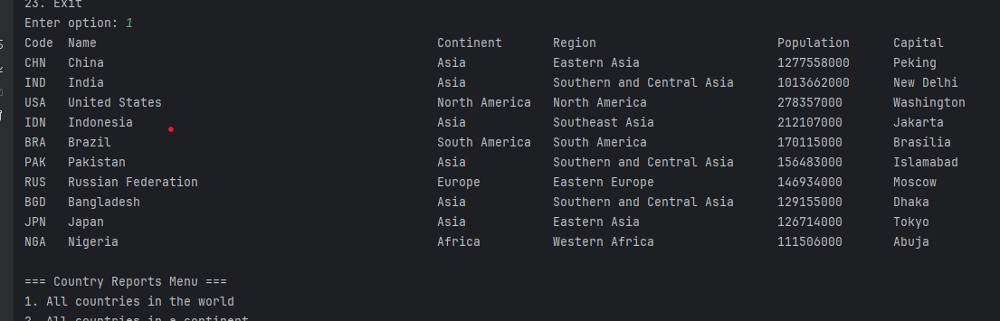

# SET09803 DevOps Group11
## GitHub Versioning
Welcome to my GitHub repository for DevOps course SET09803. 
This repository will be used to track software version 
control for this course from Intelli J app on scrum team desktop.

## Group 11 Members:
- 40738934 - Marco Riveroll
- 40725271 - Odavano Obando
- 40769780 - Seanico Pilgrim
- 40738601 - Ali Alghamdi
- 40790655 - Garvin Samuel
- 40737945 - Vikramaditya Singh

## Copyright Notice
All materials provided is developed by scrum Group 11 as part of SET09803 course assessment. Use and copying of this material is permitted under the Apache 2.0 license with suitable attribution given to the author. The author accepts no liability in the use of this material.

Master Build Status 

Develop Build Status 

License 

Release 

# DevOps Coursework Assessment Submission-Group 11

## Requirements Implemented

15 requirements of 32 have been implemented, which is 46%.

## Evidence of Requirements implemented.

| ID | Name                                                                                                                                                                                                                | Met | Screenshot              |
|---:|---------------------------------------------------------------------------------------------------------------------------------------------------------------------------------------------------------------------|-----|-------------------------|
|  1 | All the countries in the world organised by largest population to smallest.                                                                                                                                         |     |  |
|  2 | All the countries in a continent organised by largest population to smallest.                                                                                                                                       |     |                         |
|  3 | All the countries in a region organised by largest population to smallest.                                                                                                                                          |     |                         |
|  4 | The top N populated countries in the world where N is provided by the user.                                                                                                                                         |     |                         |
|  5 | The top N populated countries in a continent where N is provided by the user.                                                                                                                                       |     |                         |
|  6 | The top N populated countries in a region where N is provided by the user.                                                                                                                                          |     |                         |
|  7 | All the cities in the world organised by largest population to smallest.                                                                                                                                            |     |                         |
|  8 | All the cities in a continent organised by largest population to smallest.                                                                                                                                          |     |                         |
|  9 | All the cities in a region organised by largest population to smallest.                                                                                                                                             |     |                         |
| 10 | All the cities in a country organised by largest population to smallest.                                                                                                                                            |     |                         |
| 11 | All the cities in a district organised by largest population to smallest.                                                                                                                                           |     |                         |
| 12 | The top N populated cities in the world where N is provided by the user.                                                                                                                                            |     |                         |
| 13 | The top N populated cities in a continent where N is provided by the user.                                                                                                                                          |     |                         |
| 14 | The top N populated cities in a region where N is provided by the user.                                                                                                                                             |     |                         |
| 15 | The top N populated cities in a country where N is provided by the user.                                                                                                                                            |     |                         |
| 16 | The top N populated cities in a district where N is provided by the user.                                                                                                                                           |     |                         |
| 17 | All the capital cities in the world organised by largest population to smallest.                                                                                                                                    |     |                         |
| 18 | All the capital cities in a continent organised by largest population to smallest.                                                                                                                                  |     |                         |
| 19 | All the capital cities in a region organised by largest to smallest.                                                                                                                                                |     |                         |
| 20 | The top N populated capital cities in the world where N is provided by the user.                                                                                                                                    |     |                         |
| 21 | The top N populated capital cities in a continent where N is provided by the user.                                                                                                                                  |     |                         |
| 22 | The top N populated capital cities in a region where N is provided by the user.                                                                                                                                     |     |                         |
| 23 | The population of people, people living in cities, and people not living in cities in each continent.                                                                                                               |     |                         |
| 24 | The population of people, people living in cities, and people not living in cities in each region.                                                                                                                  |     |                         |
| 25 | The population of people, people living in cities, and people not living in cities in each country.                                                                                                                 |     |                         |
| 26 | The population of the world.                                                                                                                                                                                        |     |                         |
| 27 | The population of a continent.                                                                                                                                                                                      |     |                         |
| 28 | The population of a region.                                                                                                                                                                                         |     |                         |
| 29 | The population of a country.                                                                                                                                                                                        |     |                         |
| 30 | The population of a district.                                                                                                                                                                                       |     |                         |
| 31 | The population of a city.                                                                                                                                                                                           |     |                         |
| 32 | provide the number of people who speak the following the following languages  from greatest number to smallest, including the percentage of the world population:  Chinese, English, Hindi, Spanish, Arabic |     |                         |