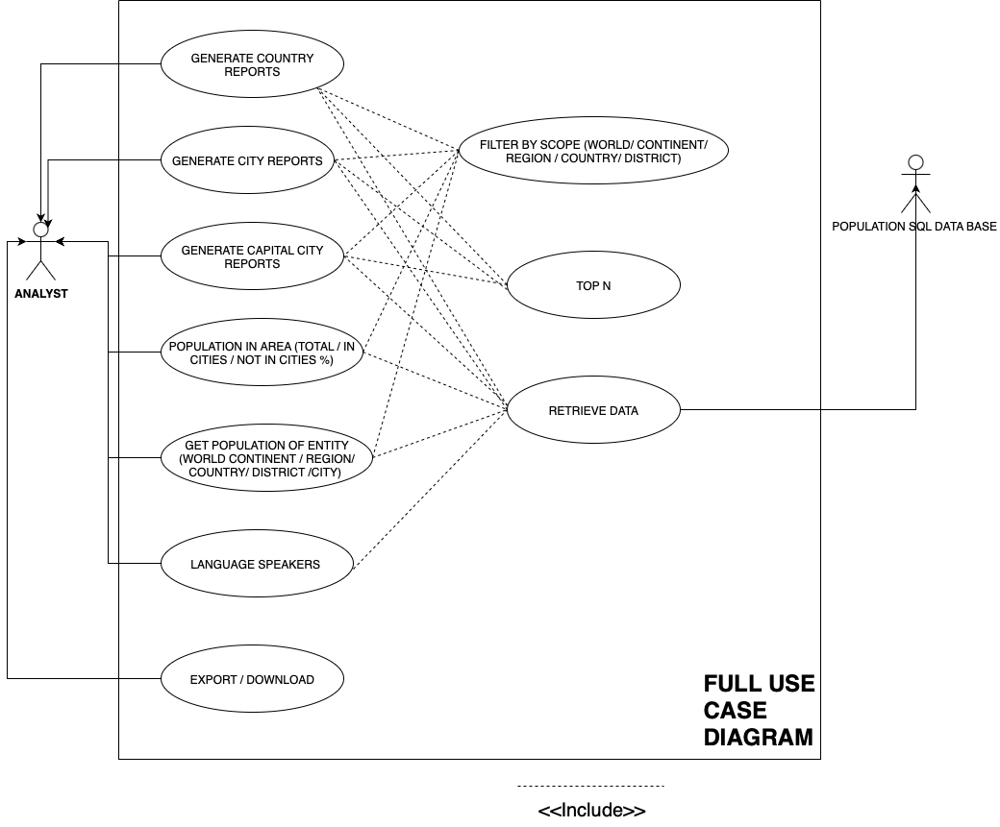
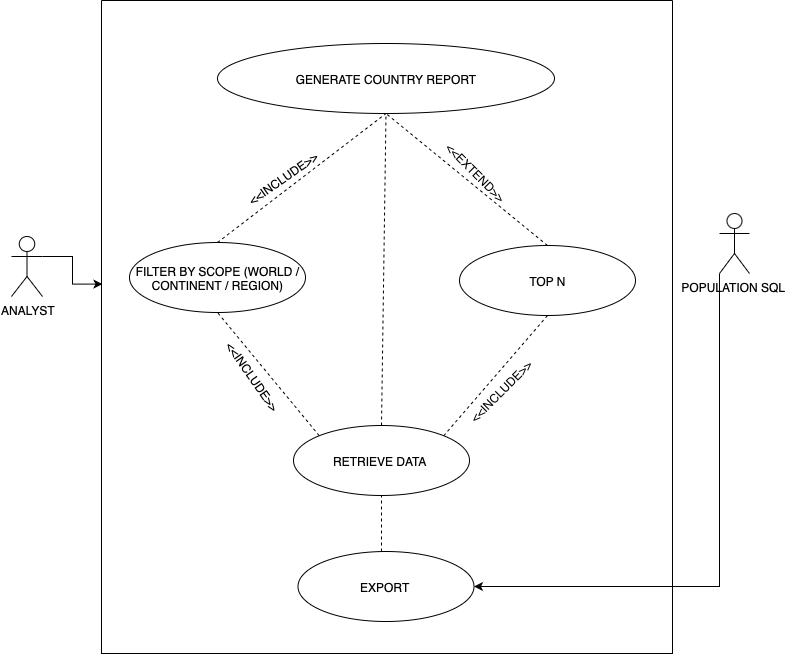

# Full Use Case Definitions

# Introduction
This document describes the complete set of use cases for our group project:  
the Population Reporting System, which is designed to help organizations  
easily access and visualize population data from a supplied SQL database.  

The use cases define how the Analyst (user) interacts with the system to  
generate reports such as *country reports, city reports, capital city reports,*  
and *population summaries*.  

Each use case includes details on its purpose, actors, preconditions,  
and expected outcomes, along with the UML diagrams that illustrate  
the system’s overall behavior.
 
The use cases correspond to the diagrams stored in the `/diagrams` folder.

# Generate Country Report
 Primary Actor: Analyst
 Population SQL Database  
 Goal: Generate a report listing all countries with Code, Name, Continent, Region, Population, and Capital , sorted by population (largest to smallest). Optional filters include *Scope*  (World / Continent / Region) and *Top N* results.

# Preconditions for the data. 
- System and SQL database are connected.
- Country and City data exist.
- Analyst selects the “Generate Country Report” option.

### Scenario
1. System displays Scope (World/Continent/Region) and optional Top N fields.  
2. Analyst provides inputs and clicks *Generate*.  
3. System validates all fields.  
4. System *includes* *Filter by Scope* and *Retrieve Data* use cases to build SQL.  
5. Query executes and returns matching records.  
6. System sorts data by population.  
7. Report is displayed with columns: Code, Name, Continent, Region, Population, Capital.  
8. Analyst may *include* *Export* to save the report.

### Postconditions
- **Success:** Report generated and optionally exported.  
- **Failure:** Error displayed; user remains on input screen.

### Business Rules
- Sorted by population (DESC).  
- Only one scope active per report.  
- Top N applied **after sorting**.  
- Capital = City linked by `Country.Capital → City.ID`.

### Non-Functional Requirements
- **Performance:** ≤3s per query.  
- **Security:** Read-only DB access; parameterized queries.  
- **Usability:** Table supports search and pagination.

### Acceptance Criteria
- Columns exactly as required.  
- Correct sorting and filtering.  
- Top N applies correctly.  
- Scope limits data correctly.  
- Export generates CSV or PDF successfully.

## Generate City Report
**Goal:** List all cities with `Name, Country, District, Population` sorted by population (DESC).  
**Scope:** World / Continent / Region / Country / District  
**Includes:** Filter by Scope, Retrieve Data, Export  
**Extends:** Top N  
**Acceptance:**  
- Displays correct city data and sorting.  
- Scope filters and Top N limit apply correctly.  
- Export works as expected.

---

## Generate Capital City Report
**Goal:** Display all **capital cities** by population.  
**Scope:** World / Continent / Region  
**Includes:** Filter by Scope, Retrieve Data, Export  
**Extends:** Top N  
**Business Rule:** Only include cities where `City.ID = Country.Capital`.  
**Acceptance:**  
- Only capitals shown.  
- Sorted by population.  
- Correct country and population values.

## Population in Area
**Goal:** Show total population, % living in cities, and % not living in cities for each Continent, Region, or Country.  
**Includes:** Retrieve Data, Export  
**Business Rules:**  
- Total = SUM(Country.Population)  
- InCities = SUM(City.Population)  
- %InCities = (InCities / Total) * 100  
- NotInCities = Total - InCities  
- %NotInCities = 100 - %InCities  
**Acceptance:**  
- Percentages sum to ≈100%.  
- Correct totals and groupings displayed.  
- Sorted by Total DESC.

## Get Population of Entity
**Goal:** Display total population for a chosen entity (World / Continent / Region / Country / District / City).  
**Includes:** Retrieve Data  
**Acceptance:**  
- Displays the correct population for selected entity.  
- Aggregates correctly for larger levels (Continent = sum of countries).

## View Language Speakers
**Goal:** Show number of speakers and percentage of world population for key languages: Chinese, English, Hindi, Spanish, and Arabic.  
**Includes:** Retrieve Data, Export  
**Business Rules:**  
- % = (Language Speakers ÷ World Population) × 100  
**Acceptance:**  
- Sorted by number of speakers (DESC).  
- Percentages rounded to 2 decimal places.  
- Export works.

## Reusable Use Cases
| Use Case | Type | Description |
|-----------|------|-------------|
| Filter by Scope | `<<include>>` | Validates and applies World/Continent/Region/Country/District filters |
| Top N | `<<extend>>` | Optionally limits results after sorting |
| Retrieve Data | `<<include>>` | Executes parameterized SQL query and returns dataset |
| Export / Download | `<<include>>` | Exports the current report to CSV or PDF |

## Diagrams

### Full System Use Case Diagram

### Generate Country Report

